

  

 




<table>
  <tr>
    <td><b>Machine Learning</b></td>
    <td>&nbsp;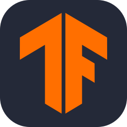&nbsp;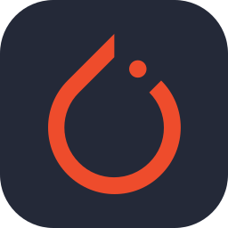&nbsp;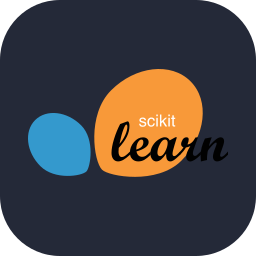</td>
    <td>Python · TensorFlow · PyTorch · scikit-learn ·Jupyter</td>
  </tr>
  <tr>
    <td><b>Web</b></td>
    <td>&nbsp;&nbsp;&nbsp;&nbsp;&nbsp;&nbsp;</td>
    <td>TypeScript · JavaScript · React · Node.js · CSS · HTML · PHP</td>
  </tr>
  <tr>
    <td><b>Mobile</b></td>
    <td>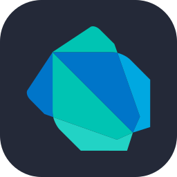&nbsp;</td>
    <td>Dart · Flutter</td>
  </tr>
  <tr>
    <td><b>Databases</b></td>
    <td>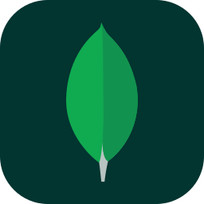&nbsp;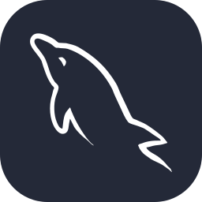</td>
    <td>MongoDB · MySQL</td>
  </tr>
  <tr>
    <td><b>Version Control</b></td>
    <td>&nbsp;</td>
    <td>Git · GitHub</td>
  </tr>
  <tr>
    <td><b>Cloud &amp; Containers</b></td>
    <td>&nbsp;</td>
    <td>AWS · Docker</td>
  </tr>
  <tr>
    <td><b>Operating Systems</b></td>
    <td>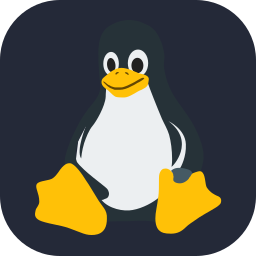&nbsp;</td>
    <td>Linux · Windows</td>
  </tr>
</table>

  
  
  

