 

### About

I'm an M.Sc. student in Computer Science at **TecNM – Instituto Tecnológico de León**, working on **pattern recognition and machine learning**. My current research explores **hybrid classifiers** that combine pretrained CNNs as feature extractors with **associative memories**, aimed at image classification when only a few samples per class are available.

Before graduate school I spent three years building production software, including two and a half years at **Scripps Research**. I care about experiments that are reproducible, well measured and honestly reported.

  

### Current work

| Project | Question | Methods |
|---|---|---|
| **Hybrid CNN + associative memory classifier**  M.Sc. research · Pattern Recognition | Can an associative memory replace the dense head of a pretrained CNN when training data per class is scarce? | Transfer learning, feature extraction, CAP associative memory |
| **Cost-sensitive k-NN benchmark**  Pattern Recognition · TecNM León | Do cost-sensitive and reconstruction-based k-NN variants beat classic k-NN on the Sonar dataset? | k-NN, Direct-CS-KNN, Distances-CS-KNN, CM-KNN, One-Step KNN, statistical testing |

### Toolkit

<table>
  <tr>
    <td><b>Machine learning</b></td>
    <td></td>
    <td>Python · TensorFlow · Jupyter</td>
  </tr>
  <tr>
    <td><b>Software</b></td>
    <td></td>
    <td>TypeScript · JavaScript · React · Node.js · C# · Dart · Flutter</td>
  </tr>
  <tr>
    <td><b>Data &amp; tooling</b></td>
    <td></td>
    <td>MongoDB · MySQL · Git · GitHub · Linux · Windows</td>
  </tr>
</table>

### Activity

  
  

 

  Open to research collaborations, PhD opportunities and ML engineering roles.

